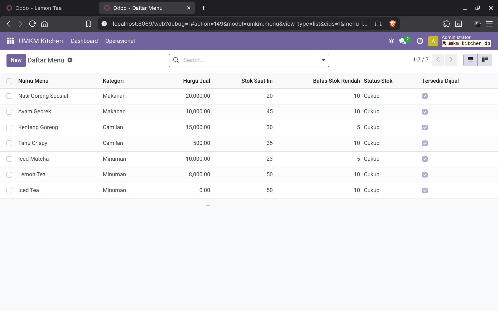

# UMKM Kitchen Management System

**UMKM Kitchen Management** adalah modul kustom Odoo Community yang dirancang untuk mengotomatisasi proses pemesanan (Point of Sale/POS *backend*) dan manajemen stok untuk usaha mikro, kecil, dan menengah (UMKM) kuliner. Proyek ini berfokus pada implementasi logika bisnis (pengurangan stok otomatis), manajemen hak akses (Role-Based Access Control/RBAC) untuk Admin dan Kasir, dan penyediaan API RESTful untuk integrasi ke frontend.

## Key Features

  * **Order Workflow Automation:** Mengelola pesanan dari *Draft* hingga *Done*, memicu aksi vital pada perubahan status.
  * **Automatic Stock Management:** Stok menu dikurangi secara *real-time* saat pesanan dikonfirmasi.
  * **Role-Based Security:** Memastikan Kasir hanya dapat melihat dan memproses order yang mereka buat.
  * **Low Stock Alert:** Sistem membuat notifikasi *chatter* (messaging) saat stok mencapai batas minimum (`low_stock_threshold`).
  * **API Integration:** Menyediakan *endpoint* yang aman dan terstruktur untuk menerima order dari aplikasi *frontend* eksternal.
  * **Operational Dashboard:** Tampilan ringkasan harian dan daftar menu dengan stok rendah.

-----

## Tech Stack

| Komponen | Teknologi | Fungsi |
| :--- | :--- | :--- |
| **Backend** | Odoo 17 Community | Framework ERP. |
| **Code Language** | Python 3.10+ | Model, logika bisnis, dan controller. |
| **Database** | PostgreSQL | Melalui Odoo ORM. |
| **Frontend/Views** | XML & QWeb | UI backend (Form/List/Dashboard) dan laporan PDF. |
| **API** | Odoo HTTP Controller | RESTful endpoints untuk diimplementasikan dengan frontend React. |

-----

## Demonstration Scenarios

### A. Business Logic & Workflow

<!-- | Fokus | Skenario | Bukti Screenshot |
| :--- | :--- | :--- |
| **1. Pengurangan Stok Otomatis** | 1. Tunjukkan **Stok Awal** Menu A. 2. Buat & **Konfirmasi** Order yang berisi Menu A. | 1. **Menu Form View** (Stok Awal). 2. **Menu Form View** (Stok setelah Order dikonfirmasi - **Tunjukkan stok berkurang**). |
| **2. Low Stock Alert** | Kurangi stok hingga **dibawah threshold**. | **Menu Form View** - Tunjukkan notifikasi *chatter* (di bagian bawah) yang berisi pesan Peringatan Stok Rendah. |
| **3. Pencegahan Order** | Coba **Konfirmasi** Order di mana jumlah yang dipesan melebihi stok yang tersisa. | Tampilan **Error Message** Odoo (`UserError`) yang muncul saat konfirmasi gagal. | -->

1. **Pengurangan Stok Otomatis**

- **Stok Awal**

- **Konfirmasi Pesanan**

- **Stok Setelah Pesanan Dikonfirmasi**

- **Validasi Stok**

- **Pembaruan Pesanan**

-----

### B. Multi Level Role

- Admin (semua order).
- Kasir (hanya order yang dibuatnya).
- Tampilan **Main Menu Navigasi** (setelah klik ikon Grid) Kasir: Menu "Kategori Menu" **tidak terlihat**.

-----

### C. Tampilan dan Pelaporan

- Tampilan list Menu dengan Stok Rendah

- **Print** laporan

-----

### D. API Integration

- **Endpoint Menu List** `/api/menu/list`

- **Endpoint Create Order** `/api/order/create`

-----

## Installation

`docker-compose up -d`